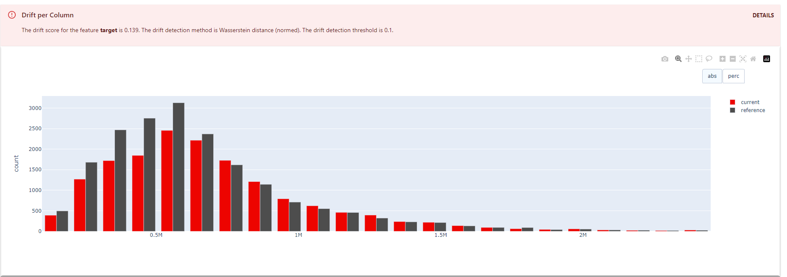
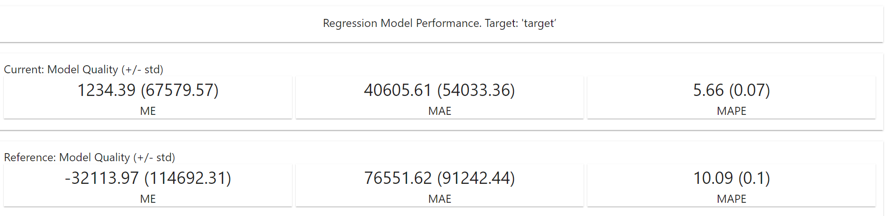

# ml-project

## Motivation

The goal of this project is to demonstrate possiblity of on-prem data exploration, Machine Learning training and deployment with help of Open Source software based on actual data from real estate market in Poland for months 08.2023-11.2023 available in [Kaggle](https://www.kaggle.com/code/krzysztofjamroz/apartment-for-sale-in-poland-data-analysis/input)

It consists of two parts:
1. Exploratory data analysis and building crude ML models to test task viability with existing data. Files for this phase can be found:
* EDA for the project is located in notebooks/apartments_eda.ipynb
* Docs: yprofile report and powerpoint presentation are located in docs/

2. automated model training, tuning and deployment with help of:
  * pandera data quality checks while loading CSV data
  * scikit-learn for building the model pipeline
  * Optuna for testing large number of pipelines of reconfigurable structure, hyperparameter tuning and dynamic relevant columns selection
  * mlflow for tracking experiments and exposing models for inference
  * streamlit and pydentic for simple GUI application to enable facilitate prediction inference

Data preparation is minimal in this demo as I'd expect data preparation and curation would be taks of data engineering team.

## Workflow

1. Start the project:
* create secrets_local and secrets_test files based on available secrets.example file
* run `./conf/env/run_local.sh`

It will start:
* Optuna dashboard on http://localhost:8080/
* mlflow on           http://localhost:5000
* minio replacement of S3 on http://localhost:9001/

2. Edit or add configuration file in conf/base to select columns that will be
  * included in the training - in this case all remaining columns will be excluded except for parametrized columns
  * excluded from the training - in this case all remaining columns will be included except for parametrized columns
  * parametrized - optuna will create search space with possible combinations of columns excluded and included

3. Edit files in src/mlproject/optunasetup/lib/ to add imputers, scalers, encoders and ML algorithms together with their hyperparameters
4. Run `python -m mlproject` with following options\
Options:\
`  --config_file TEXT          [required]`\
`  --experiment_name TEXT`\
`  --number_of_trials INTEGER  [required]`\
`  --prune Flag                Use MedianPruner to prune nonpromising trials`\
`  --sampler TEXT               TPESampler(default) or RandomSampler if 'Random' used`\
`  --preprocess_data           Reprocess data before training`\
`  --data_drift                Compare result with ref dataset to discover data and model drift`\
`  --help                      Show this message and exit.`

For example:\
`python -m mlproject --config_file=apartments_selected_columns.yml --experiment_name=apartments_selected_columns_linear --number_of_trials=100 --sampler=Random --preprocess_data`

`apartments_selected_columns.yml` contains configuration limiting number of selected features to those that were discovered during EDA phase to provide most predictive power (`city`,`squareMeters`,`centreDistance`,`buildYear`,`latitude`,`longitude`)

`experiment_name` denotes the model name available later in mlflow. The workflow is configured to save only the best model based on selected metrics. If you reuse the `experiment_name` in the next command run, it will save the model only if it's performance is better than the best existing model of this name. In this case it will create new version of that model.

If user wishes to start search with new configuration or parameters, it's recommended to use new unique `experiment_name`

Next to ML model parameters and metrics the flow exports also Optuna dashboard's visualizations to MLFlow:
* [Parameter Importances](https://optuna.readthedocs.io/en/v2.0.0/reference/generated/optuna.visualization.plot_param_importances.html)
* [Optimization history](https://optuna.readthedocs.io/en/stable/reference/visualization/generated/optuna.visualization.plot_optimization_history.html)

As explained, only best Optuna attempts are stored in mlflow. To see performance of all Optuna trials and their parameters visit Optuna Dashboard: http://localhost:8080/

5. Log in to mlflow http://localhost:5000 and review existing trials. Select the model version that serves best your needs in terms of performance and attach alias 'best' to it.
6. Run `streamlit run src/app.py -- --run_name apartments_selected_columns` to start streamlit app that is available on http://localhost:8501
Select input data and click button 'Predict' - you'll get prediction based on selected model from mlflow together with estimated error.
You'll get warning if you provide invalid input data outside of expected range.

**Tests**:
1. unit tests: `pytest`
2. integration tests: `./tests/integration_tests/run_test.sh`

## Optuna benefits

Optuna is an automatic hyperparameter optimization software framework that allows for very flexible definition of ML experiments. Optuna surpasses other tools by allowing users to:
1. programmatically specifying not only the hyperparameters to be used in each Machine Learning algorithm but also:
   1. the list of algorithms themselves
   2. other elements of ML pipeline, like encoders, scalers, imputers, etc
2. treat feature selection as another hypertuning dimension - this may be superfluous after Feature Engineering properly done and expensive in terms of computing, but still may prove useful for example just to verify if including column in new iteration of data provides better results.
3. visualize search peformence of all Optuna's trials in [visualizations](https://optuna.readthedocs.io/en/stable/reference/visualization/index.html) provided by Optuna dashboard. It may prove very useful in finding function minima by visualization of how search result depends on each feature space separately.
4. utilize pruning optimization that stops unpromising trials early during the optimization process ans allows for saving time and resources
5. integrates easily with mlflow

Special kudos to Walter Sperat who described thoroughly potential of Optuna configuration in [series of articles](https://medium.com/@walter_sperat/using-optuna-with-sklearn-the-right-way-part-1-6b4ad0ab2451)

## Data and model drift detection - DVC & Evidently

After you run extensive experiments on various algorithms and best model with optimal hyperparamters is found, you may run the project in the production mode by running the project on consecutive batches of production data with `--data_drift` option which:
* always triggers data preprocessing (data cleaning)
*  for each batch but the first one set alias based on curret git commit message - this is to integrate processing of consecuitve batches with DVC, as shown here:
```
cd data/
cp 00_source/apartments/apartments_pl_2023_09.csv.zip 01_raw/apartments/apartments.csv.zip #data/00_source simulates data source with consecutive batches coming each month
dvc add 01_raw/apartments/apartments.csv.zip     #record new version of input data
dvc push                                         #push the file to DVC remote which is S3 Minio storage (set up in run_local.sh)
git add 01_raw/apartments/apartments.csv.zip.dvc #record new version of data in SCM
git commit -m '09_2023'                          #in commit message provide value that is suitable for MLFlow alias and describe current batch
python -m mlproject --config_file=apartments_selected_columns.yml --experiment_name=apartments_selected_columns_drift --number_of_trials=20 --sampler=Random --detect_drift                  #run the hyperparameter search to build model that fits current data best
`````
Recording of DVC data versions of available four months of data is stored on branch `detect_drift`
* for each batch but the first one, build Evidently's
  * [Data Drift](https://docs.evidentlyai.com/presets/data-drift) Report to detect drift between current and first batch of data
  * [Regression Model Drift](https://docs.evidentlyai.com/presets/reg-performance) Report and Test to detect peformance improvement between current best model (build upon first batch, marked manually with 'best' alias in MLFlow) and new version of model built based on current batch.
  All Evidently objects are uploaded as artifacts to MLFlow for later review
* if data or model drift is detected, respectively `data_drift` or `model_drift` alias is set to current version of the model

### Results
After processing all files MLFlow shows Evidently detects both data and model drift


Data drift pertains only to 1 column - price - apparently data was taken during booming real estate market and for apartment with the same features prices were significantly higher 4 months later


Full data drift [report](./docs/evaluation/data_drift.html)

Current model built on freshest data has MAPE lower by 4.43%:


Ful reports for November:
[model quality report](./docs/evaluation/regression_quality_report.html)
[model quality test result](./docs/evaluation/regression_quality_test.html)
